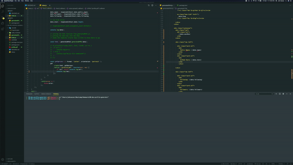

# 09-dev-profile-generator

Both the await.js & index.js work and will render the same result.

# Description

A command-line application that dynamically generates a PDF profile from a GitHub users, username.

The PDF will display:

- Profile image
- User name
- Links to the following:
  - User location via Google Maps
  - User GitHub profile
  - User blog
- User bio
- Number of public repositories
- Number of followers
- Number of GitHub stars
- Number of users following

# About

This is is built with .js, node.js, npm packages = [fs, axios, html-pdf, inquirer].
It is there if your manager ever needs slicks on their employees github accounts.

WHEN RUNNING IN THE COMMAND LINE, WAIT FOR THE PROMPT TO OPEN UP NEW .PDF DOCUMENTS.
THERE WILL BE A CONSOLE LOG ALERTING YOU OF THE PROCESS COMPLETION.
command line will also print the newly created file-path.

# Installation / Usage

clone to your device, open in you code editor and run command 'npm install'. Check package.json for npm packages. run 'node index.js'.
The command line will prompt you for input from there.

# Built with

- javascript
- html5

npm packages:

- [Fs](https://www.npmjs.com/package/fs-js)
- [Html-pdf](https://www.npmjs.com/package/html-pdf)
- [Inquirer](https://www.npmjs.com/package/inquirer)
- [Axios](https://www.npmjs.com/package/axios)

# Banter

    -   ALGORITHM OF SUCCESS
    while(noSuccess){
        tryAgain();
    if(dead)
    break();
    }
